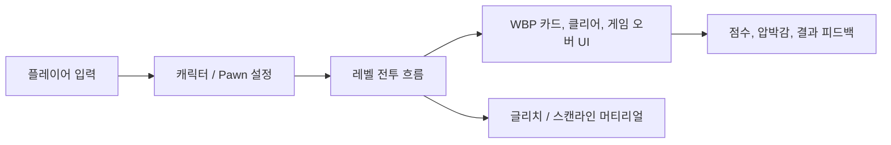

# KPI Overload

압박감, 점수, 빠른 전투 흐름을 중심으로 만든 Unreal Engine 5 기반 1인칭 액션 프로토타입입니다.

<p>
  
  
  
</p>

## 개요

KPI Overload는 짧은 액션 게임 데모를 구성하는 맵, UI 위젯, 캐릭터 자산, 시각 효과 소재를 포함한 Unreal 프로젝트입니다. `.uproject` 구조를 그대로 유지하므로 Unreal Editor에서 바로 열 수 있습니다.

## 프로젝트 구조

```text
.
├── KPI_OVERLOAD.uproject        # Unreal 프로젝트 설명 파일
├── Config/                      # 엔진, 입력, 에디터, 게임 설정
├── Content/                     # 맵, 위젯, 자산, 머티리얼, 폰트
└── README.md
```

게임 플레이와 직접 연결되는 구성은 대부분 `Content/` 아래 Unreal 자산으로 관리됩니다.

- `WBP_*` 위젯: 카드 선택, 클리어, 게임 오버 화면
- `M_*` 머티리얼: 스캔라인과 글리치 스타일 UI
- `NewMap`, `NewWorld`, `Untitled` 등 `.umap` 레벨
- 에디터 프로젝트 실행에 필요한 폰트, 캐릭터, 게임플레이 자산

## 로컬 실행

1. Unreal Engine 5를 설치합니다.
2. Git LFS를 활성화한 상태로 저장소를 clone합니다.
3. Unreal Editor에서 `KPI_OVERLOAD.uproject`를 엽니다.
4. Unreal이 요청하는 프로젝트 파일과 derived data 재생성을 진행합니다.
5. `Content/`의 메인 맵을 열고 Play를 실행합니다.

```bash
git lfs install
git clone https://github.com/JunnnnyWon/KPI-OVERLOAD-JAI2025.git
```

## 구조 흐름



## 작업 메모

- Unreal 캐시 폴더와 자동 생성 파일은 Git에 넣지 않습니다.
- 큰 바이너리 자산은 Git LFS로 관리합니다.
- 새 게임플레이 조각을 추가할 때는 임시 이름보다 역할이 드러나는 맵과 위젯 이름을 사용합니다.
- 자산 변경을 push하기 전에 Unreal Editor에서 프로젝트가 열리는지 확인합니다.
