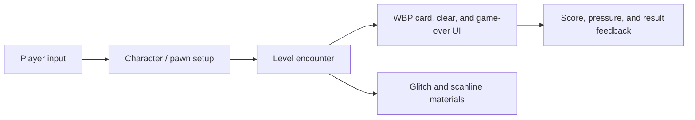

# KPI Overload

Unreal Engine 5 project for **KPI Overload**, a first-person action prototype built around pressure, scoring, and fast encounter pacing.

<p>
  
  
  
</p>

## Overview

KPI Overload is an Unreal project containing gameplay maps, UI widgets, character assets, and visual materials for a compact action-game demo. The repository keeps the full `.uproject` layout so it can be opened directly in Unreal Editor.

## Project Layout

```text
.
├── KPI_OVERLOAD.uproject        # Unreal project descriptor
├── Config/                      # Engine, input, editor, and game settings
├── Content/                     # Maps, widgets, assets, materials, fonts
└── README.md
```

Most gameplay-facing work lives in `Content/` as Unreal assets:

- `WBP_*` widgets for card picking, game clear, and game-over screens
- `M_*` materials for scanline and glitch-style UI treatment
- `.umap` levels including `NewMap`, `NewWorld`, and `Untitled`
- bundled font and character/gameplay assets required by the editor project

## Run Locally

1. Install Unreal Engine 5.
2. Clone the repository with Git LFS enabled.
3. Open `KPI_OVERLOAD.uproject` from Unreal Editor.
4. Let Unreal rebuild project files and derived data when prompted.
5. Open the main map from `Content/` and press Play.

```bash
git lfs install
git clone https://github.com/JunnnnyWon/KPI-OVERLOAD-JAI2025.git
```

## Architecture



## Notes for Contributors

- Keep Unreal-generated cache folders out of Git.
- Use Git LFS for large binary assets.
- Prefer small, named maps and widgets over anonymous test assets when adding new gameplay slices.
- Validate the project by opening it in Unreal Editor before pushing asset changes.
